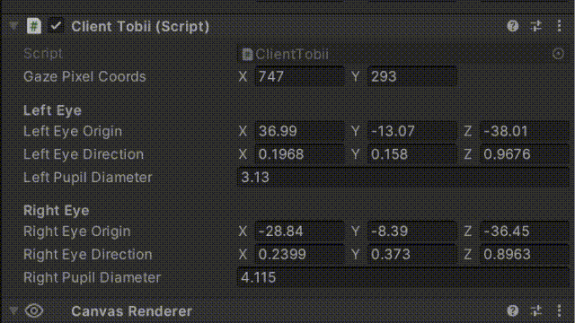

# Tobii Glasses 3 Unity - ROS Integration

This Unity project receives data from Tobii Glasses 3. 
It displays **gaze information** *(pixel coordinates, eyes origin, direction and pupils diameter)* and **camera feed** with gaze fixation.
This data is sent to **ROS** with [ROS-TCP-Connector](https://github.com/Unity-Technologies/ROS-TCP-Connector).

------

## Instructions
1. Download Unity 2021.3.42
2. Clone the [Tobii Glasses 3 Server](https://github.com/lagenuina/TobiiGlasses3-Server.git) repository and follow the instructions to set up the project. This repository is **required**: it uses the Tobii Glasses 3 Python library to handle communication with the Glasses3 WebSocket API. It acts as a server for streaming real-time data from Tobii Glasses 3 to Unity
3. Clone this repository into a separate directory from the Tobii Glasses 3 Server:
   ```
   git clone https://github.com/lagenuina/TobiiGlasses3-Unity-ROS.git
   ```
4. In Unity, open the project in the Unity folder. Navigate to Scenes and select "Tobii Glasses"
5. Insert the IP address of your ROS machine under *Robotics -> ROS Settings -> ROS IP Address*
6. Play the Unity project
7. Follow instructions [here](https://github.com/lagenuina/TobiiGlasses/tree/main?tab=readme-ov-file) to run the *sendgazedata.py* script.

All set! In the *Data Receiver* Game Object in Unity, you will be able to see:



The camera feed and gaze will be displayed as follows:


8. In ROS, subscribe to the following topics:
   - `/gaze/pixel_coordinates`: Provides the pixel coordinates of the user's gaze on the video frame.
   - `/gaze/left_eye_origin`: The 3D coordinates of the origin (center) of the left eye.
   - `/gaze/right_eye_origin`: The 3D coordinates of the origin (center) of the right eye.
   - `/gaze/left_eye_direction`: The estimated gaze direction in 3D. The origin of this vector is the */gaze/left_eye_origin*.
   - `/gaze/right_eye_direction`: The estimated gaze direction in 3D. The origin of this vector is the */gaze/right_eye_origin*.
   - `/gaze/left_eye_pupil`: Diameter in millimeters of the left pupil.
   - `/gaze/right_eye_pupil`: Diameter in millimeters of the right pupil.
